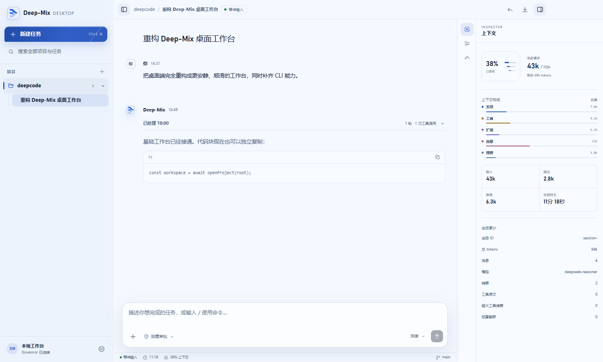
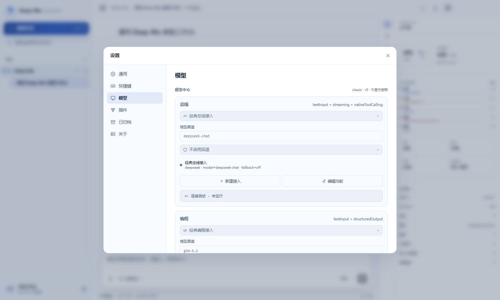
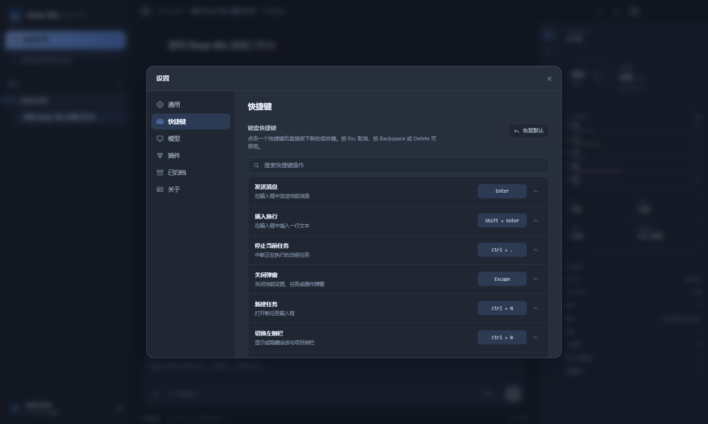
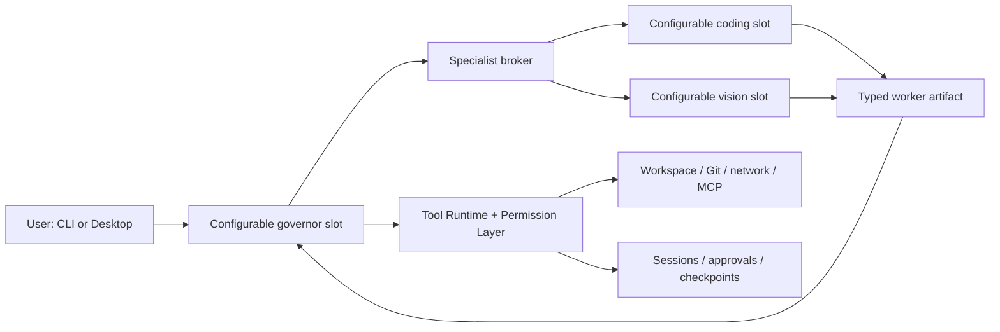

# Deep-Mix

[简体中文](README.zh-CN.md) · [Getting started](docs/getting-started.md) · [Security model](docs/security-model.md) · [Contributing](CONTRIBUTING.md)

Deep-Mix is a local-first, multi-model coding-agent runtime. A configurable `governor` slot is the single governor and supervisor; isolated `coding` and `vision` slots provide specialist assistance; every workspace side effect still passes through one permissioned tool runtime. `DeepSeek + GLM + Kimi` remains available as the `classic` compatibility preset, not as a fixed runtime contract.

> **v1.1.0 is a source release for developers.** It includes a CLI and an Electron desktop application, but no signed installer or hosted service. Model API usage is billed by the providers you configure.



| v1.1.0 model center | Configurable keyboard shortcuts |
| --- | --- |
|  |  |

## Why Deep-Mix

Most multi-model demos route a prompt and concatenate answers. Deep-Mix treats orchestration as a runtime problem:

- one governor owns the conversation, plan, routing, supervision, and final answer;
- specialist workers return typed artifacts and never write the workspace directly;
- tool schemas, availability, permissions, checkpoints, and audit records are centralized;
- sessions, approvals, worker artifacts, and rollback data are persisted locally;
- skills, deterministic workflows, and MCP integrations have separate extension boundaries;
- CLI and Desktop reuse the same governor, persistence, and permission layers.



## What is included

- Persistent multi-turn CLI with resume, export, undo, context diagnostics, and approvals
- Electron desktop client with project selection, session management, attachments, themes, configurable shortcuts, model-profile editing, and approval UI
- Configurable model profiles and `governor` / `coding` / `vision` slot bindings with capability gates and ordered fallbacks
- Streaming governor control, isolated workers, context compaction, immutable assignment snapshots, and history-integrity repair
- Permission modes: `plan`, `edit`, `auto`, and `danger-full-access`
- Built-in repository, file, patch, shell, Git, web, document, spreadsheet, presentation, notebook, archive, and quality tools
- Checkpointed writes and rollback records
- Local Skills, Workflows, and MCP discovery
- Runtime capability detection and bounded tool selection

## Quick start

Requirements: Node.js `22.12+`, npm `10+`, Git, and one compatible governor profile. Windows 10/11 with PowerShell is the primary verified environment; the TypeScript core is portable, but platform-heavy tests are currently Windows-oriented.

```powershell
git clone https://github.com/1157360333-a11y/deep-mix.git
cd deep-mix
npm ci
Copy-Item examples\profiles.example.json .deep-mix\api-key-library\profiles.local.json
```

Set the environment variable referenced by the example profile:

```powershell
$env:DEEPSEEK_API_KEY = "your-key"
```

Update the example profile's model name if your provider account uses a different current model, then verify and start:

```powershell
npm run probe:model -- --profile deepseek_governor
npm run cli -- --workspace C:\path\to\your-project --mode auto
```

Or launch the desktop application:

```powershell
npm run app
```

The local profile file is ignored by Git. Prefer `apiKeyEnvName` over storing a key in JSON. See [Getting started](docs/getting-started.md) for the complete setup and [Configuration](docs/configuration.md) for precedence rules.

## CLI examples

```powershell
# Help and version do not initialize a model connection
npm run cli -- --help
npm run cli -- --version

# Start with a task
npm run cli -- --workspace C:\path\to\repo --mode auto --prompt "Explain this repository"

# Read-only planning
npm run cli -- --workspace C:\path\to\repo --mode plan

# Resume the latest resumable session
npm run cli -- --workspace C:\path\to\repo --resume

# Inspect extensions
npm run cli -- --list-skills
npm run cli -- --mcp-status
```

## Safety boundary

Deep-Mix is **not a sandbox**. It runs with the operating-system privileges of the current user. The permission layer controls which registered tools can run, records approvals, protects configured paths, and checkpoints supported mutations; it cannot contain arbitrary native code after you approve its execution.

Managed background-process tools are experimental and **disabled by default**. They can be enabled with `experimental.managedProcesses: true` only after reviewing [Security model](docs/security-model.md). A child process that deliberately detaches or double-forks may escape lifecycle tracking on platforms without OS-level containment.

Never commit `.deep-mix/api-key-library/profiles.local.json`, provider keys, session state, or worker artifacts. Start with `plan` or `auto`; reserve `danger-full-access` for disposable or well-understood workspaces.

## Documentation

| Document | Purpose |
| --- | --- |
| [Getting started](docs/getting-started.md) | Installation, first profile, first launch |
| [First task walkthrough](docs/first-task-walkthrough.md) | A safe end-to-end repository task |
| [CLI guide](docs/cli-guide.md) | Flags, slash commands, sessions, and routing |
| [Desktop guide](docs/desktop-guide.md) | Desktop development entry and project workflow |
| [Configuration](docs/configuration.md) | Profiles, settings, precedence, and examples |
| [Architecture](docs/deep-mix-architecture.md) | Runtime components, trust boundaries, data flow |
| [Security model](docs/security-model.md) | Threat model, permissions, secrets, limitations |
| [Extensions](docs/extensions.md) | Skills, Workflows, MCP, and repository rules |
| [Testing](docs/testing.md) | Fast, integration, platform, and release checks |
| [Troubleshooting](docs/troubleshooting.md) | Common setup and runtime failures |
| [Roadmap](docs/roadmap.md) | Explicit post-1.0 work, not release promises |
| [v1.1.0 release notes](docs/releases/v1.1.0.md) | Scope, migration, verification, and known limitations |
| [v1.0.0 release notes](docs/releases/v1.0.0.md) | Initial public source release |

Machine-readable runtime contracts are published under [`docs/contracts`](docs/contracts/README.md).

## Development

```powershell
npm ci
npm run check
npm test
npm run desktop:build
```

`npm test` intentionally runs the fast release gate. Use `npm run test:integration`, `npm run test:platform`, or `npm run test:full` for progressively broader coverage. See [Testing](docs/testing.md).

## Project status

`v1.1.0` adds configurable model orchestration, user-level workspace state, and a substantially revised Desktop experience while preserving the single-governor and permission-layer boundaries. It does not claim OS-level process isolation, signed binaries, hosted synchronization, or compatibility with every OpenAI-compatible provider. Known limitations are tracked in the [release notes](docs/releases/v1.1.0.md) and [roadmap](docs/roadmap.md).

## License

Copyright 2026 QCY. Licensed under the [Apache License 2.0](LICENSE).
