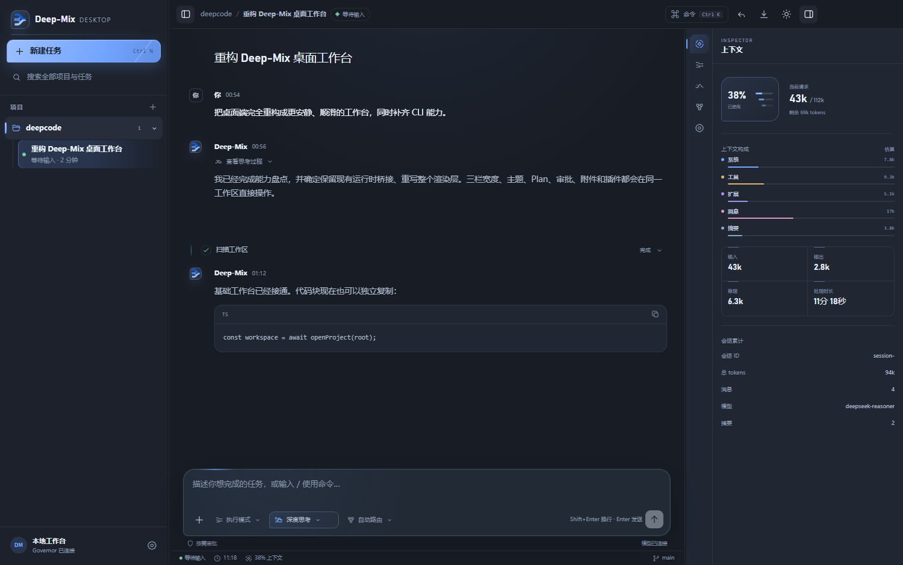

# Deep-Mix

[English](README.md) · [快速开始](docs/getting-started.md) · [安全模型](docs/security-model.md) · [参与贡献](CONTRIBUTING.md)

Deep-Mix 是一个本地优先的多模型 coding agent runtime。DeepSeek 是唯一的 governor 与 supervisor；可选的 GLM、Kimi worker 分别提供隔离的编码和视觉协助；所有最终工作区副作用仍统一经过 `Tool Runtime + Permission Layer`。

> **v1.0.0 是面向开发者的源码版本。** 仓库包含 CLI 与 Electron Desktop，但暂不提供签名安装包或托管服务。模型调用费用由你配置的服务商收取。



## 它解决什么问题

Deep-Mix 不只是把提示词路由给多个模型，而是把多模型协作做成一套可审计的 runtime：

- 一个主控负责对话、规划、路由、监督、验收和最终回答；
- 专业 worker 只返回结构化 artifact，不能直接写入工作区；
- 工具 schema、可用性、权限、checkpoint 与审计记录集中管理；
- 会话、审批、worker artifact 和 rollback 数据保存在本地；
- Skills、确定性 Workflows 与 MCP 分属不同扩展边界；
- CLI 与 Desktop 共用同一套 governor、持久化与权限层。

## 当前包含

- 支持恢复、导出、撤销、上下文诊断和审批的多轮 CLI
- 支持项目选择、会话管理、附件、主题和审批的 Electron Desktop
- 支持流式输出、工具调用、上下文压缩和历史完整性修复的 DeepSeek 主控
- 可选的隔离 GLM 编码 worker 与 Kimi 视觉 worker
- `plan`、`edit`、`auto`、`danger-full-access` 四种权限模式
- 仓库、文件、补丁、Shell、Git、网络、文档、表格、演示文稿、Notebook、归档和质量工具
- 写入 checkpoint 与 rollback 记录
- 本地 Skills、Workflows、MCP 发现
- runtime 能力探测与按需工具选择

## 快速开始

要求：Node.js `22.12+`、npm `10+`、Git，以及一个可用的 DeepSeek-compatible API profile。当前主要验证环境是 Windows 10/11 + PowerShell；TypeScript 核心具备可移植性，但平台相关测试目前偏向 Windows。

```powershell
git clone https://github.com/1157360333-a11y/deep-mix.git
cd deep-mix
npm ci
Copy-Item examples\profiles.example.json .deep-mix\api-key-library\profiles.local.json
$env:DEEPSEEK_API_KEY = "your-key"
```

如果你的账号使用不同的当前模型名，请修改示例 profile，然后探活并启动：

```powershell
npm run probe:model -- --profile deepseek_governor
npm run cli -- --workspace C:\path\to\your-project --mode auto
```

桌面端入口：

```powershell
npm run app
```

真实 profile 文件已被 Git 忽略；建议使用 `apiKeyEnvName`，不要把 key 直接写进 JSON。完整步骤见[快速开始](docs/getting-started.md)，配置优先级见[配置说明](docs/configuration.md)。

## 常用命令

```powershell
npm run cli -- --help
npm run cli -- --version
npm run cli -- --workspace C:\path\to\repo --mode plan
npm run cli -- --workspace C:\path\to\repo --mode auto --prompt "解释这个仓库"
npm run cli -- --workspace C:\path\to\repo --resume
npm run cli -- --list-skills
npm run cli -- --mcp-status
```

## 安全边界

Deep-Mix **不是操作系统沙箱**。它继承当前用户的系统权限。权限层负责约束已注册工具、记录审批、保护配置路径并为支持的变更加 checkpoint；当你批准执行任意原生代码后，它无法继续保证系统级隔离。

托管后台进程工具属于实验功能，且**默认关闭**。只有阅读[安全模型](docs/security-model.md)后，才应通过 `experimental.managedProcesses: true` 显式开启。缺少 OS 级 containment 时，恶意 detach 或 double-fork 子进程可能脱离生命周期跟踪。

不要提交 `profiles.local.json`、API key、会话状态或 worker artifact。日常优先使用 `plan` 或 `auto`；仅在可丢弃或完全理解的工作区中使用 `danger-full-access`。

## 文档导航

| 文档 | 内容 |
| --- | --- |
| [快速开始](docs/getting-started.md) | 安装、首个 profile、首次启动 |
| [第一个任务](docs/first-task-walkthrough.md) | 安全完成一次仓库任务 |
| [CLI 指南](docs/cli-guide.md) | 参数、斜杠命令、会话和路由 |
| [Desktop 指南](docs/desktop-guide.md) | 桌面端开发入口与项目流程 |
| [配置说明](docs/configuration.md) | Profiles、settings、优先级与示例 |
| [架构](docs/deep-mix-architecture.md) | 组件、信任边界与数据流 |
| [安全模型](docs/security-model.md) | 威胁模型、权限、密钥与限制 |
| [扩展机制](docs/extensions.md) | Skills、Workflows、MCP 与仓库规则 |
| [测试说明](docs/testing.md) | 快速、集成、平台与发布验证 |
| [故障排查](docs/troubleshooting.md) | 常见安装和运行问题 |
| [路线图](docs/roadmap.md) | 1.0 之后的方向，不构成发布承诺 |
| [v1.0.0 发布说明](docs/releases/v1.0.0.md) | 范围、兼容性与已知限制 |

## 开发与验证

```powershell
npm ci
npm run check
npm test
npm run desktop:build
```

`npm test` 是快速发布门禁。更广覆盖请使用 `npm run test:integration`、`npm run test:platform` 或 `npm run test:full`。

## 版本定位

`v1.0.0` 冻结公开架构和首个源码发布契约，但不代表已经具备 OS 级进程隔离、签名二进制、云同步或对所有 OpenAI-compatible 服务商的兼容。请查看[发布说明](docs/releases/v1.0.0.md)与[路线图](docs/roadmap.md)。

## License

Copyright 2026 QCY。使用 [Apache License 2.0](LICENSE) 开源。
