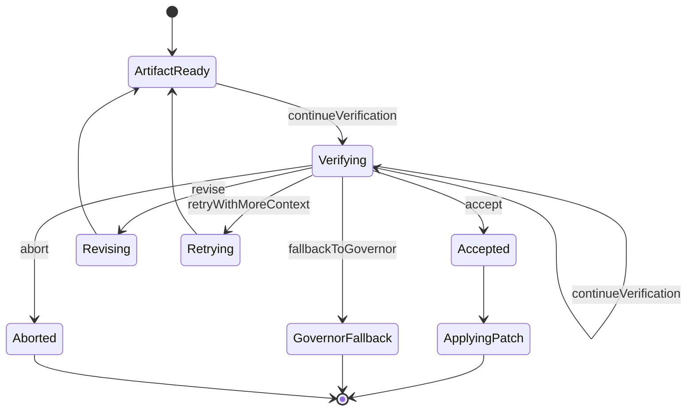

# SupervisorDecision 状态机草案

## 1. 允许动作

- `accept`
- `revise`
- `retryWithMoreContext`
- `fallbackToGovernor`
- `continueVerification`
- `abort`

## 2. 语义约束

- `accept` 只表示 artifact 可以进入落地环节，不代表任务最终完成。
- `revise` 表示继续使用同一 worker session 迭代，不自动切主模型。
- `retryWithMoreContext` 表示补充 `contextRefs` 后重试，仍然保持当前 worker 类型。
- `fallbackToGovernor` 表示停止使用当前 worker，由 `DeepSeek` 直接接手。
- `continueVerification` 表示继续运行测试、读文件、比对 diff 等验证动作。
- `abort` 表示当前任务分支终止，不再继续 worker 或落地动作。

## 3. 状态转移

## 4. 守卫条件

- 没有合法 `WorkerArtifact` 时，不允许进入 `accept`。
- `retryWithMoreContext` 必须显式提供新增 `extraContextRefs`。
- `continueVerification` 必须显式给出下一批 `verificationCommands` 或等价验证动作。
- 所有决策都必须附带 `reason` 与 `evidenceRefs`，避免出现不可追溯的隐式状态。
