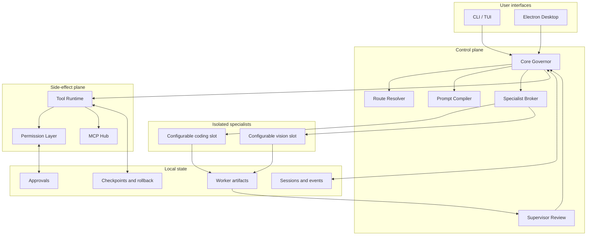
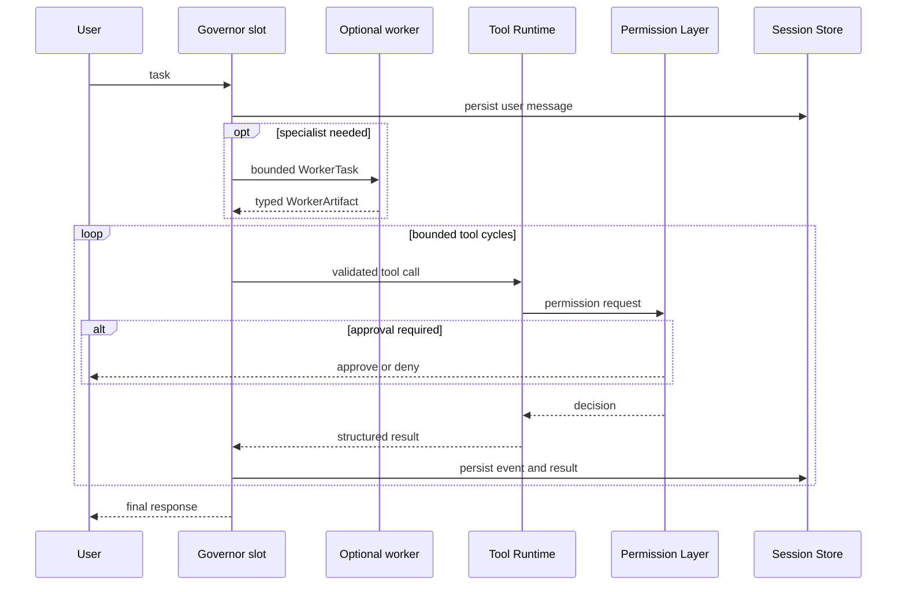

# Deep-Mix Architecture

This document defines the public architecture of Deep-Mix v1.1.0. Runtime behavior and machine-readable contracts take precedence over aspirational roadmap items.

## 1. Design goals

Deep-Mix is designed around five invariants:

1. **One accountable governor.** The configured `governor` slot owns the user conversation, routing, plan, supervision, and final response.
2. **Workers are isolated specialists.** The configured `coding` and `vision` slots receive bounded tasks and return typed artifacts; they do not become co-governors or write the workspace directly.
3. **Side effects use one control plane.** Workspace writes, commands, tests, Git operations, network calls, and MCP actions pass through the Tool Runtime and Permission Layer.
4. **State is durable and local.** Sessions, approvals, checkpoints, worker events, and artifacts can survive process restarts.
5. **Extensions keep distinct semantics.** Repository rules, Skills, Workflows, MCP servers, and Workers are not interchangeable.

Non-goals for v1.1.0 include an OS security sandbox, cloud synchronization, a hosted multi-user control plane, and signed desktop installers. The `classic` preset binds DeepSeek, GLM, and Kimi-compatible profiles for continuity, but provider names are not role contracts.

## 2. System view

## 3. Turn lifecycle

A normal turn follows this sequence:

1. The interface creates or resumes a session and records the user's message.
2. The governor validates history integrity and compiles repository rules, recent context, active plan state, relevant skills, and available tool definitions.
3. The route resolver keeps the task with the governor or proposes a bounded coding/vision worker task after capability checks.
4. A worker, when used, receives selected context only and returns a `WorkerArtifact` or a structured failure. It has no direct workspace write capability.
5. The governor reviews the artifact and decides whether to accept, reject, revise, or execute a proposed action.
6. Tool calls are resolved against the registry, validated against JSON Schema, checked for availability, projected through the current permission mode, and passed to the permission layer.
7. Approved tools execute with bounded input, output, timeout, path, and network policies. Supported mutations create checkpoints and audit records.
8. Results are persisted before the governor produces the durable final response. Large outputs may be summarized while raw artifacts remain locally addressable.

## 4. Trust boundaries

### Governor boundary

The selected `governor` slot is the only component allowed to act as governor. Worker text is evidence, not authority. A worker cannot approve itself, alter the plan invisibly, call MCP directly, or claim that a patch was applied.

### Worker boundary

The coding slot receives coding-oriented context and the vision slot receives image-oriented context. Their adapters enforce role-specific request and response contracts. The coding worker reports `workspaceWriteAccess: false`; proposed changes travel as artifacts for governor review and Tool Runtime application.

### Tool boundary

Tools are registered by modules with stable names, input schemas, permission categories, side-effect levels, timeout categories, capability requirements, and selection metadata. The full registry, the per-turn provider subset, and MCP Resources are separate concepts.

Unavailable tools stay visible to runtime diagnostics but are excluded from the provider-facing selection. Managed background-process tools are registered but unavailable unless explicitly enabled.

### Operating-system boundary

The runtime is not a container or VM. Approved shell commands and native programs execute as the current OS user. Path checks and permission decisions reduce risk but cannot constrain code after the OS executes it. See [Security model](security-model.md).

## 5. Permissions and checkpoints

`plan` is intended for inspection and planning. `edit` permits controlled workspace changes with approval behavior. `auto` applies the normal policy and requests approval for guarded actions. `danger-full-access` removes most interactive friction but does not remove schema validation, protected-path checks, or audit records.

The permission layer classifies tool effects such as reading, writing, command execution, network access, and external system mutation. An approval can be denied, allowed once, or persisted for the current session when supported.

Checkpoint-capable tools record enough information for a later `/undo` or rollback operation. A checkpoint is not a full filesystem snapshot: unsupported external effects, remote systems, arbitrary commands, and processes may not be reversible.

## 6. Persistence model

Runtime state is stored below `~/.deep-mix/workspaces/<workspace-id>/` by default. `DEEP_MIX_HOME` can replace the user-state root. Important categories include:

- `sessions/` and `sessions-index.json` for session events and lookup;
- `approval-records/` for permission decisions;
- `checkpoints/` and `rollback-records/` for supported mutation recovery;
- `worker-sessions/` and `worker-artifacts/` for specialist work;
- `telemetry/` for local runtime metrics;
- `mcp-artifacts/` for external-tool artifacts;
- `skills/`, `workflows/`, and `mcp/` for project extensions;
- `api-key-library/` for local provider profiles.

These directories may contain repository content, prompts, model output, absolute paths, and credentials. They are local state, not source material, and must not be committed or attached to public issues without review. Project `.deep-mix/` remains an explicit configuration boundary and a legacy-read source; ordinary workspace initialization does not create it.

## 7. Configuration layers

Settings are loaded from the user file and then the project file:

1. `%USERPROFILE%/.deep-mix/settings.json`
2. `<workspace>/.deep-mix/settings.json`

Project values override user values through a deep merge. CLI flags override launch defaults. Provider-specific environment variables override legacy launch values where implemented. Provider profiles prefer user-level workspace state and should reference environment variables for secrets. Version 2 settings bind profiles to `governor`, `coding`, and `vision` slots with revisioned compare-and-swap writes.

See [Configuration](configuration.md) for exact examples.

## 8. Extension boundaries

- **`AGENTS.md`** contains durable repository rules, safety constraints, verification commands, and collaboration conventions.
- **Skills** contain reusable guidance discovered from `.deep-mix/skills/<name>/SKILL.md` or compatibility paths.
- **Workflows** contain deterministic step definitions discovered from `.deep-mix/workflows/*.workflow.json`.
- **MCP** represents live external systems configured in `.deep-mix/mcp/servers.json`.
- **Workers** are model-specific, typed specialist adapters governed by the Specialist Broker.

An extension does not bypass the Tool Runtime. For example, a skill can recommend a Git operation, but only a registered Git or shell tool can perform it.

## 9. Package map

| Path | Responsibility |
| --- | --- |
| `apps/cli` | Argument parsing, TUI/fallback shell, approvals, session commands |
| `apps/desktop` | Electron main/preload/renderer application and IPC boundary |
| `packages/core-governor` | Turn orchestration, prompts, model client, history, supervisor review |
| `packages/route-resolver` | Provider profiles, route features, route decisions |
| `packages/specialist-broker` | Worker task dispatch, lifecycle, structured artifact handling |
| `packages/worker-glm-coding` | Isolated coding-worker adapter |
| `packages/worker-kimi-vision` | Isolated vision-worker adapter and image normalization |
| `packages/tool-runtime` | Tool modules, registry, selection, execution, process management |
| `packages/safety` | Permission policy, approvals, path and side-effect controls |
| `packages/persistence` | Sessions, events, artifacts, checkpoints, metrics |
| `packages/shared-schema` | Shared TypeScript contracts and runtime vocabulary |
| `packages/settings` | User/project settings loading and merge behavior |
| `packages/skill-engine` | Skill discovery and matching |
| `packages/workflow-runtime` | Deterministic workflow discovery and execution |
| `packages/mcp-hub` | MCP configuration, status, resources, and execution adapters |
| `packages/model-adapters` | Provider-neutral completion adapters, profile resolution, capability gates, and redacted public DTOs |
| `packages/state-location` | User-level Deep-Mix home and stable workspace-state location derivation |
| `packages/diagnostics` | Capability and diagnostic reporting |
| `packages/evals` | Local evaluation helpers; private evaluation records are not published |

## 10. Failure and recovery

The runtime distinguishes provider failures, worker failures, invalid tool arguments, unavailable capabilities, permission denials, command failures, timeouts, interruption, and malformed history. Failures are persisted as structured events when possible.

On restart, the session store recovers active state and repairs or falls back from incomplete tool-message groups. This prevents orphaned tool messages from being sent back to a provider. Recovery favors a safe durable boundary over pretending that an interrupted action completed.

Managed process ownership is tied to a runtime session, but OS-level containment is not implemented in v1.1.0. Consequently, the feature is opt-in and documented as experimental.

## 11. Public contracts

Stable wire-level vocabulary is published in [`docs/contracts`](contracts/README.md), including WorkerTask, WorkerArtifact, RouteProfile, CheckpointRecord, and SupervisorDecision. These contracts describe boundaries; the TypeScript definitions in `packages/shared-schema` remain the executable source of truth.

## 12. Versioning

The public repository follows Semantic Versioning. A breaking change to configuration, CLI behavior, state format, extension discovery, or published contracts requires a major version unless a documented migration preserves compatibility. Internal phase names and private evaluation evidence are not part of the public API.
