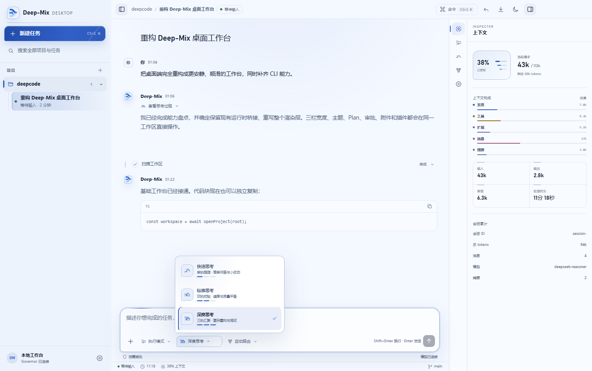

# Desktop guide

Deep-Mix Desktop is an Electron development application backed by the same governor, session store, workers, and permission layer as the CLI.



## Start the app

```powershell
npm ci
npm run app
```

Equivalent development command:

```powershell
npm run desktop:dev
```

The first launch may take longer while Electron and Vite build the main, preload, and renderer bundles.

## Create a task

1. Open the new-task view.
2. Select or enter the target project directory.
3. Choose a permission mode and optional route/reasoning preferences.
4. Add text or supported attachments.
5. Send the task and respond to approvals in the composer area.

The chosen directory becomes the runtime workspace. Local session state and checkpoints are stored under that workspace's `.deep-mix/` directory.

## Session management

The sidebar exposes persisted tasks across known workspaces. Current features include opening and resuming a task, renaming, pinning, unread state, copying the session ID, archiving, and deleting through the UI. Verify the selected workspace before resuming a similarly named task.

Sent attachments move out of the composer and remain represented in the conversation. User and assistant messages provide copy controls.

## Desktop commands

Type `/help` in the composer for the current list. Desktop supports common session commands such as `/context`, `/compact`, `/status`, `/session`, `/resume`, `/continue`, `/undo`, `/export`, `/new`, and zoom controls. The Desktop command set is not identical to the CLI set.

## Approvals and user input

Pending approvals appear above the input area. Review the action, path, command, and requested persistence before choosing allow or deny. A blocking structured question also prevents an unrelated message until it is answered or cancelled.

## Build and preview

```powershell
npm run desktop:build
npm run desktop:preview
```

The build command produces development bundles under `apps/desktop/out/`. Those outputs are ignored and are not signed installers. v1.0.0 does not include packaging, code signing, auto-update, or a distribution channel.

## Themes and zoom

Desktop supports light/dark presentation and UI zoom. Theme and task preferences are local UI state. Provider keys remain in the protected profile file or environment, never in renderer code.

## Troubleshooting

- If the app opens but a task cannot start, verify the target workspace and `deepseek_governor` profile.
- If the renderer is blank after a dependency change, stop the dev process, run `npm ci`, and restart.
- If a session appears missing, select the original workspace; sessions are workspace-local.
- If an attachment fails, confirm its type and size and retry without unrelated attachments.
- Use the CLI for the most detailed capability and fallback diagnostics.

See [Troubleshooting](troubleshooting.md) for more cases.
